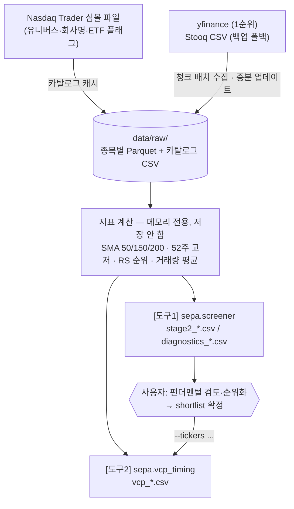

# 데이터 자료구조 정리

> **기준일**: 2026-07-16 (Phase 4 전 종목 수집 완료 직후)
> **시각화 요약본**: 프로젝트 아티팩트 `data_structure_overview.png` 참조

---

## 1. 저장소 레이아웃

```
data/raw/                          # 가격 데이터 캐시 (.gitignore — 재생성 가능)
├── _nasdaq_listed.csv             # 유니버스 카탈로그 (3,279종목 메타데이터)
├── AAPL.parquet                   # 종목별 일봉 OHLCV (1종목 = 1파일)
├── MSFT.parquet
├── ...                            # 총 3,278개 (나스닥 전 종목, ETF 제외)
└── ZYME.parquet

reports/                           # 실행 결과 (.gitignore — 실행일별 생성)
├── stage2_YYYYMMDD.csv            # [도구1] Stage 2 "회사명-티커" 리스트
├── diagnostics_YYYYMMDD.csv       # [도구1] 전 종목 조건별 진단
└── vcp_YYYYMMDD.csv               # [도구2] shortlist VCP 시그널

config/
├── params.yaml                    # 전략·필터 파라미터 (버전 관리 대상)
└── universe.yaml                  # 파일럿 유니버스 티커 목록
```

**설계 원칙** (docs/strategy_spec.md §6과 대응):

| 원칙 | 구현 |
|---|---|
| 유동적 확장 | 종목 1개 = 파일 1개. 종목 추가/삭제가 다른 파일에 영향 없음 |
| 증분 업데이트 | 파일의 마지막 저장일 이후만 재요청 (`store.get_history` / `store.bulk_update`) |
| 스키마 고정 | 모든 종목 파일이 동일한 6개 필드 구조 |
| 카탈로그 분리 | 종목 목록·회사명은 데이터가 아닌 카탈로그(`_nasdaq_listed.csv`)로 관리 |
| 재생성 가능 | `data/`와 `reports/`는 git 제외. 코드 + 설정만으로 언제든 재구축 |

---

## 2. 종목별 가격 파일 — `data/raw/{TICKER}.parquet`

전 종목 동일 스키마. 인덱스는 tz 없는 정규화된 거래일.

| 필드 | 타입 | 설명 |
|---|---|---|
| `date` (index) | `datetime64` | 거래일 (타임존 제거, 자정 정규화, 중복 제거, 오름차순) |
| `open` | `float64` | 시가 — **분할·배당 수정주가** |
| `high` | `float64` | 고가 — 수정주가 |
| `low` | `float64` | 저가 — 수정주가 |
| `close` | `float64` | 종가 — 수정주가 (`auto_adjust=True`) |
| `volume` | `float64` | 거래량 (주 수) |

실제 샘플 (AAPL 최근 3행, 총 752행 / 2023-07-17 ~ 2026-07-15):

```
date          open    high    low     close   volume
2026-07-13    317.02  323.45  315.78  317.31  43,257,800
2026-07-14    313.76  316.19  311.91  314.86  36,336,800
2026-07-15    317.62  328.72  317.32  327.50  60,780,931
```

정규화 규칙(`sources.normalize_ohlcv`): MultiIndex 컬럼 평탄화 → 소문자 통일 →
스키마 6필드만 유지 → 인덱스 정리 → `close` 결측 행 제거 → `float64` 캐스팅.

---

## 3. 유니버스 카탈로그 — `data/raw/_nasdaq_listed.csv`

Nasdaq Trader 공식 심볼 파일의 로컬 캐시 (오프라인 실행 대비). 파일명의
언더스코어(`_`)는 티커 파일과의 충돌 방지용.

| 필드 | 설명 | 활용 |
|---|---|---|
| `symbol` | 티커 | 파일명·조인 키 |
| `security_name` | 증권명 ("Apple Inc. - Common Stock") | " - " 앞부분만 잘라 회사명으로 사용 |
| `market_category` | Q/G/S (Global Select/Global/Capital) | 미사용 |
| `test_issue` | 테스트 종목 여부 | `N`만 통과 |
| `financial_status` | 재무 상태 (D=미달 등) | `N`(정상)만 통과 |
| `round_lot_size` | 호가 단위 | 미사용 |
| `etf` | ETF 여부 | **`N`만 통과 (ETF 제외 핵심 필드)** |
| `nextshares` | NextShares 여부 | 미사용 |

추가 티커 필터: 특수문자(`. $ + =`) 포함 제외, 5글자 티커의 마지막 글자
R(라이트)/U(유닛)/W(워런트) 제외 → **5,565행 → 3,279종목**.

---

## 4. 리포트 파일 (실행 결과)

### 4.1 `reports/stage2_YYYYMMDD.csv` — [도구1] 출력

| 필드 | 예시 | 설명 |
|---|---|---|
| `ticker` | `AMD` | 티커 |
| `name` | `Advanced Micro Devices, Inc.` | 회사명 (카탈로그 조인) |
| `close` | `529.14` | 기준일 종가 |
| `rs_rank` | `98.0` | RS 백분위 순위 (정렬 키, 내림차순) |

### 4.2 `reports/diagnostics_YYYYMMDD.csv` — [도구1] 진단

stage2 필드 + `stage2`(bool), `failed_conditions`(실패 조건 콤마 목록, 예:
`5_above_short_ma,8_rs_rank`). 유동성 필터 통과 종목 전체가 대상 (2026-07-16
기준 951행).

### 4.3 `reports/vcp_YYYYMMDD.csv` — [도구2] 출력

`ticker, signal, close, pivot, dist_to_pivot_pct, trend_ok, base_weeks,
footprint, final_depth_pct, dryup_ratio, volume_vs_avg, note`
(의미는 `docs/strategy_spec.md` §5.2 참조)

---

## 5. 데이터 흐름



지표(SMA, 52주 고저, RS 등)는 **디스크에 저장하지 않고** 실행 시마다 원본
OHLCV에서 재계산한다. 파라미터 변경 시 재계산 비용이 낮고(전 종목 수 초 수준),
저장 데이터와 지표 정의가 어긋나는 정합성 문제를 원천 차단하기 위함이다.

---

## 6. 수집 현황 스냅샷 (2026-07-16)

| 항목 | 값 |
|---|---|
| 파일 수 | 3,278개 (+카탈로그 1개) |
| 총 행 수 | 2,127,698행 |
| 총 용량 | 약 92 MB (평균 28 KB/종목) |
| 기간 | 최대 3년 (2023-07-17 ~ 2026-07-15, 752거래일) |
| 풀 히스토리 보유 | 2,528종목 (나머지는 신규상장으로 짧음) |
| 수집 성공률 | 3,277/3,279 (99.9%) |
| 품질 | OHLC NaN 0건 · 무결성 위반 0건 · 분할 수정주가 검증 통과 |
